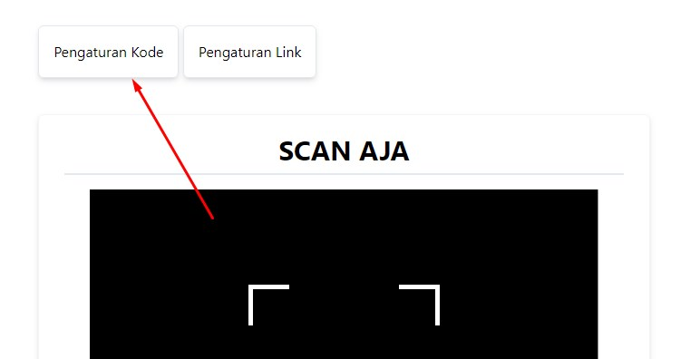
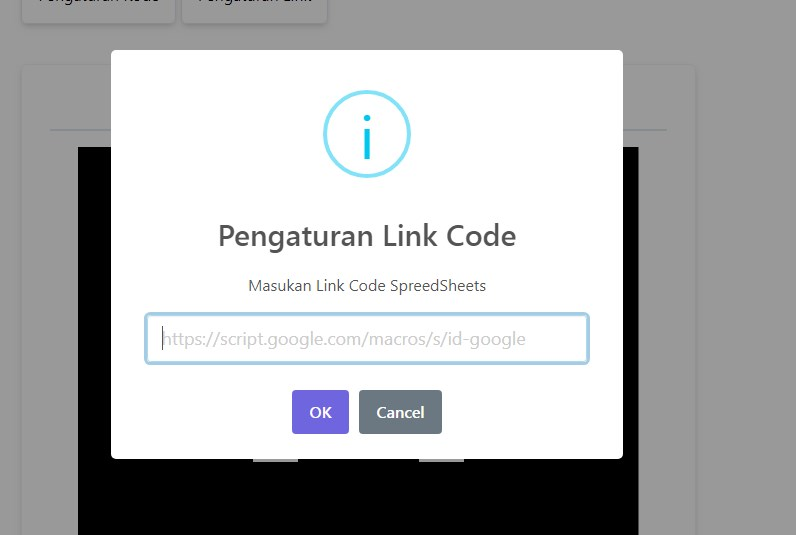
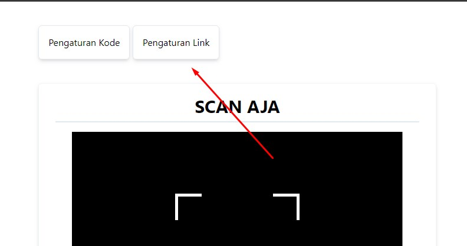
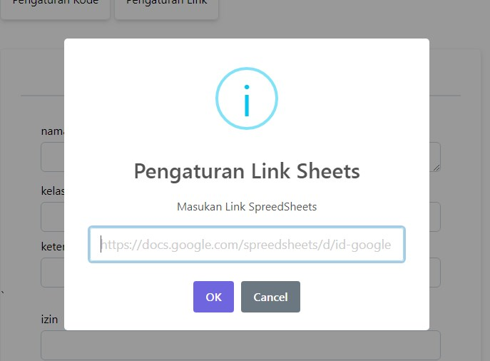
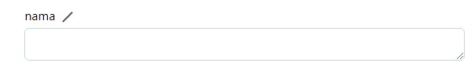

# SCAN AJA

Aplikasi yang terintregrasi dengan Scanning Module, untuk memudahkan penginputan data dan Kasir.
> AzkaPrata BANDUNG@2024
## RESEP


## FITUR

- **Aplikasi** yang dibuat untuk konfigurasi pengguna (**KONFIGURASI PENUH**)
- Scanning QRCode
- Uploading To SpreedSheet (Google Sheet)

## Konfigurasi Awal

### Konfigurasi SpreedSheet DataBase
-   Salin LINK Code SpreedSheet ([Cara Mengambil Link](./config/codelink.md))
-   Klik Kebagian Yang Ditunjuk Oleh Panah Merah 
-   Masukan Link Kebagian Input Yang Tersedia 
-   Seteleah Itu Klik OKE

### Konfigurasi SpreedSheet
-   Salin Link SpreedSheet Kamu ([Cara Mengambil Link](./config/sheetlink.md))
-   Klik Bagian Yang Ditunjuk Oleh Panah Merah 
-   Masukan Pada Bagian Input Yang Tersedia 
-   Klik Oke Maka Konfigurasi Akan Tersimpan


### Konfigurasi Kategori
-   Klik gambar pensil yang tersedia di samping kategori yang ingin kamu ubah 
-   Kemudian Masukan Nama Kategori Dibilah yang Diinginkan
    -   Ingat!! Nama yang dimasukan harus tidak melebih 2 kata. Seperti : ```nama```, atau bisa dimasukan dengan format : ```namapelanggan```.
    -   Nama Yang dimasukan harus mirip dengan nama/judul yang ada di sheet

- Kemudian Klik Oke hingga Konfigurasi selesai.
