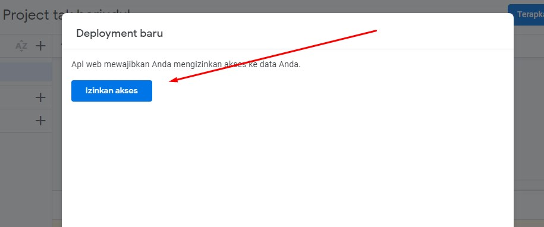

# Cara Mengambil Dan Mengonfigurasi Tabel DataBase

### Pembuatan Tabel Dan k
-   Masuk Ke Google Sheet dan buat sheet baru 
-   Kemudian Masukan Judul di tabel yang tersedia 
-   Setelah judul ditetapkan Klik Bagian Ekstensi yang ditunjuk oleh panah merah 
-   Kemudian Pilih App Script
-   Setelah itu kamu akan diarahkan ke bagian editor script  ganti judul script dengan *AUTOMATED*
-   Setelah itu hapus Kode default yang telah tersedia 
-   Dan Masukan script berikut :   

```
var sheetName = 'Sheet1'
var scriptProp = PropertiesService.getScriptProperties()

function intialSetup () {
  var activeSpreadsheet = SpreadsheetApp.getActiveSpreadsheet()
  scriptProp.setProperty('key', activeSpreadsheet.getId())
}

function doPost (e) {
  var lock = LockService.getScriptLock()
  lock.tryLock(10000)

  try {
    var doc = SpreadsheetApp.openById(scriptProp.getProperty('key'))
    var sheet = doc.getSheetByName(sheetName)

    var headers = sheet.getRange(1, 1, 1, sheet.getLastColumn()).getValues()[0]
    var nextRow = sheet.getLastRow() + 1

    var newRow = headers.map(function(header) {
      return header === 'timestamp' ? new Date() : e.parameter[header]
    })

    sheet.getRange(nextRow, 1, 1, newRow.length).setValues([newRow])

    return ContentService
      .createTextOutput(JSON.stringify({ 'result': 'success', 'row': nextRow }))
      .setMimeType(ContentService.MimeType.JSON)
  }

  catch (e) {
    return ContentService
      .createTextOutput(JSON.stringify({ 'result': 'error', 'error': e }))
      .setMimeType(ContentService.MimeType.JSON)
  }

  finally {
    lock.releaseLock()
  }
} 
```
- Setelah itu klik icon Save 
- Kemudian klik jalankan dan pastikan Kotak Merah berisi `initialsetup` 
- Maka akan muncul pemberitahuan akses izin, klik tinjau 
- Pilih akun yang ingin digunakan untuk akses 
- Kemudian akan muncul Peringatan, klik yang ditunjuk oleh panah merah 
- setelah itu klik lanjutkan ke AUTOMATED 
- Izinkan pada bilah selanjutnya 
- Maka akan muncul log seperti ini 
- Kemudian klik terapakan tombol yang di tunjuk oleh panah merah 
- 
- Di konfigurasi pilih Aplikasi Web 
- 
- pastikan untuk mengizinkan akses ke akun google
- Ketikan nama di desripsi kemudian klik Terapkan 
- pastikan untuk menympan url web sebelum menutup jendela 
- kemudian masuk ke Tab Trigger/Pemicu (gambar Jam Beker) 
- terus klik tombol Tambahkan Pemicu 
- Pilih fungsi yang dijalankan menjadi `doPost` 
- Pilih jenis acara menjadi Saat Mengirim formulir
- 
- Setelah itu Klik Simpan
- Masukan Link url tadi ke Pengaturan Kode
- Konfigurasi Selesai
