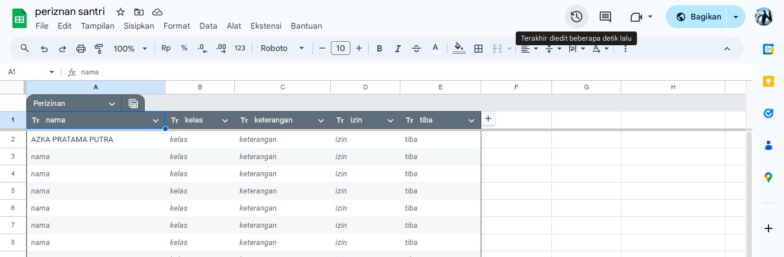
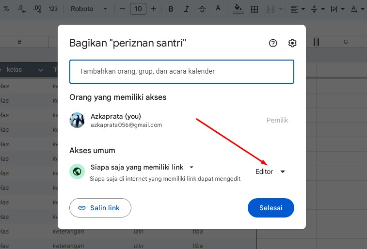

# Cara Mengambil Link Sheet

- Masuk ke SpreedSheet yang dikonfigurasi tadi 
- kemudian klik Bagikan/Share
- Setelah itu ganti pengaturan yang ditunjuk ole panah merah menajdi editor
- kemudian salin Link dan klik simpan
- masukan Link ke Pengaturan Link
- Konfigurasi selesai